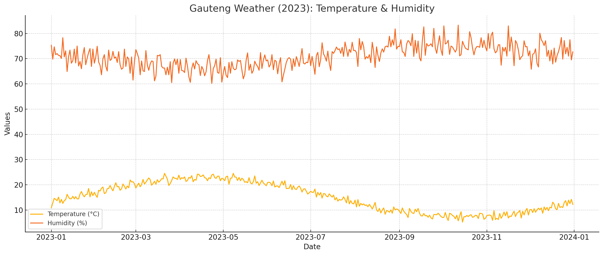

# Weather Forecast Assessment (Intermediate Developer Level)

## 🧠 Objective
You are provided with a starter Python script using [Prophet](https://facebook.github.io/prophet/) and mock weather data. Your task is to fix, improve, and extend the script for better functionality, performance, and flexibility.

This assessment tests your:
- Understanding of **data science workflows**
- Ability to **leverage AI/ML tools** like Prophet
- **Code optimization** and refactoring skills
- Skill in **bug fixing and feature extension**

You need to get your AI to successfully predict the temperature in degrees Celsius 7 days into the future.

---

## 📁 Provided Files

- `forecast.py`: Initial (buggy and limited) implementation using Prophet
- `weather.csv`: 365 days of mock weather data for Gauteng South Africa 2023
- `weather_plot.png`: Visualization of Gauteng, South Africa weather trends for 2023 

> The weather data used in this assessment reflects **Gauteng, South Africa's seasonal patterns for 2023**, including temperature and humidity.

---

## 🧪 Tasks

### 🔧 Bug Fixes
- [ ] Fix failure when loading or parsing the CSV file (date handling).
- [ ] Handle cases where forecast output is unclear or missing required columns.

### 🚀 Optimization
- [ ] Refactor the code to improve readability and modularity.
- [ ] Add exception handling and input validation.

### 🌟 Feature Additions
- [ ] Add CLI arguments using `argparse`:
  - `--input`: path to input CSV file
  - `--periods`: number of days to forecast (default: 7)
  - `--output`: optional path to save forecast CSV
- [ ] Use humidity as a regressor in your forecast 
- [ ] Add plotting of forecast using `matplotlib` or `plotly`

### 🤖 Prophet Enhancements
- [ ] Customize Prophet with additional seasonalities or holiday effects
- [ ] Improve the accuracy of forecasting through parameter tuning, using `optuna`

---

## ✅ Submission Checklist

- [ ] Updated `forecast.py` with fixed bugs, added features, and cleaned code
- [ ] CLI functionality added
- [ ] Forecast plots generated
- [ ] Optional forecast CSV output working
- [ ] Code does not crash on valid input
- [ ] Short `README` or docstring added to your script (if needed)
- [ ] Developer comments included throughout the code
- [ ] Documentation added to the README describing your changes
- [ ] Work completed in a Git branch named `/submissions/<candidate_name>`
- [ ] Commit messages are detailed and descriptive
- [ ] Code pushed to a GitHub repository to demonstrate Git workflow understanding

---

## 💡 Bonus (Optional)

- [ ] Add unit tests using `pytest`

---

## ⏱ Estimated Time
6 hours

---

## 📬 How to Submit
Submit the updated project folder containing:
- Modified `forecast.py`
- Any additional modules or files you created
- A brief note if you made architectural decisions or assumptions
- Ensure all your work is committed and pushed to a GitHub branch `/submissions/<your_name>` with meaningful commit messages and added documentation.
- Please submit the project to your own repo, and supply luan with the repo link

Good luck!

---

## 🗓️ Task Breakdown with Estimated Time

| Task Section              | Description                                                                 | Estimated Time |
|--------------------------|-----------------------------------------------------------------------------|----------------|
| Bug Fixes                | Fix date parsing, handle invalid CSVs or forecast columns                   | 1 hour         |
| Code Optimization        | Refactor code, improve modularity, add validation and error handling        | 1.5 hours      |
| CLI Feature Additions    | Implement argparse support with CLI args and flags                          | 1 hour         |
| Humidity Regressor       | Add humidity as external regressor to Prophet model and future dataframe    | 0.5 hour       |
| Forecast Plotting        | Visualize predictions using matplotlib or plotly                            | 0.5 hour       |
| Prophet Tuning           | Use Optuna to tune Prophet parameters with cross-validation                 | 1 hour         |
| Final Review & Polish    | Final testing, output saving, update README and comments                    | 0.5 hour       |

**Total: 6 hours**